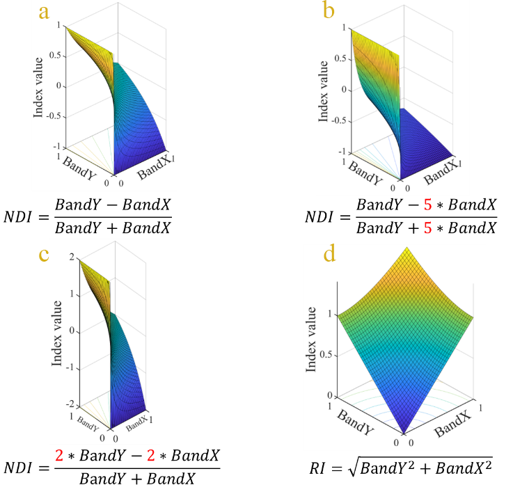

# Paper with code

GND:A normalized difference form more suitable for remote sensing applications.
https://doi.org/10.36227/techrxiv.21687326.v1

<div  align="center">
 
</div>

## Changelog
2022/12/12

Add dataset(Cropped)

Update source code(rebuild by mmseg1.0)

Add Paper(Preprint)
## Dataset/Model

Supported datasets:

- [x] [RIT-18](https://github.com/rmkemker/RIT-18)


Supported backbones:

- [x] [Swin Transformer (ICCV'2021)](https://github.com/microsoft/Swin-Transformer)
- [x] [ConvNeXt (CVPR'2022)](https://github.com/facebookresearch/ConvNeXt)

Supported methods:

- [x] [UPerNet (ECCV'2018)](configs/upernet)


## Installation

Please refer to [get_started.md](https://github.com/open-mmlab/mmsegmentation/blob/dev-1.x/README.md) for install mmseg1.0

Clone my git

Download [shadow_dataset](https://drive.google.com/file/d/12fvd1He8hQdkC2PTBLM_X2mwR92BcStF/view?usp=share_link) and
[sun_dataset](https://drive.google.com/file/d/1--j4s1uvJiONb7apNJ9V3syrmWgY2o9u/view?usp=share_link)

Place the dataset as follows:
```none
mmsegmentation
├── configs
├── data
│   ├── RIT-18
│   │   ├── sun
│   │   │   ├── clip_sun_label
│   │   │   ├── clip_sun_index_img
│   │   │   ├── clip_sun_band_img
│   │   ├── shadow
│   │   │   ├── clip_shadow_label
│   │   │   ├── clip_shadow_index_img
│   │   │   ├── clip_shadow_band_img
├── mmseg
├── tests
├── tools
...
```

## Get Started

------

## Build GND

<div  align="center">
 
</div>

## Acknowledgement

We thank [openMMlab](https://github.com/open-mmlab) for the open-source libraries with excellent features.

## Citation

If you find this project useful in your research, please consider cite:

```BibTeX
zou, linxin; Wei, Bo (2022): GND:A normalized difference form more suitable for remote sensing applications. TechRxiv. Preprint. https://doi.org/10.36227/techrxiv.21687326.v1 
```

## License

This project is released under the [Apache 2.0 license](LICENSE).
